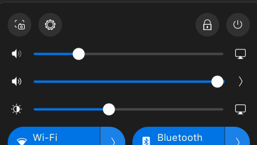
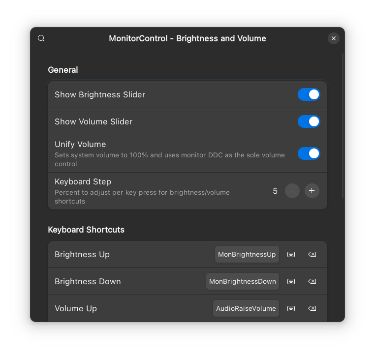

# 🖥️ MonitorControl — Brightness & Volume

**Near-instant DDC/CI brightness and volume control for external monitors, built right into the GNOME Quick Settings panel.**

<p align="center">
  
</p>

[](LICENSE)
[](https://extensions.gnome.org/extension/9665/monitorcontrol-brightness-and-volume/)

---

## ✨ Features

- 🔆 **Brightness & volume sliders** added directly to the Quick Settings panel
- 🔊 **Unify Volume** — locks GNOME's system volume at 100% and delegates all volume control to your monitor's DDC, eliminating double-volume confusion
- ⌨️ **Keyboard shortcuts** with live key-capture dialog and configurable step size
- 🔇 **Mute shortcut** — toggles monitor volume between 0 and its last non-zero value
- 🎧 **Headphone awareness** — DDC volume keys automatically yield to the system volume handler when headphones or a headset is the active audio output, and re-engage when you switch back to speakers
- 🛠️ **Custom ddcutil path** — point to any ddcutil binary, no `$PATH` required
- 🔔 **Error notifications** — system notification if `ddcutil setvcp` fails
- ⚡ Optimized for **ddcutil 2.x** dynamic sleep for maximum responsiveness
- 🔄 Automatically re-detects monitors and restores state on re-login

---

## 📸 Screenshots

| Quick Settings | Preferences |
|:-:|:-:|
|  |  |

---

## 📋 Requirements

- GNOME Shell **45 – 49**
- [`ddcutil`](https://www.ddcutil.com/) installed and accessible
- I²C permissions configured for your user

Verify your setup before installing:

```sh
ddcutil detect
ddcutil getvcp 10   # brightness
ddcutil getvcp 62   # volume
```

If `detect` works but the extension can't find your monitor, see [🔧 Troubleshooting](#-troubleshooting).

### 🔑 I²C permissions

```sh
# Add yourself to the i2c group (log out and back in after)
sudo usermod -aG i2c $USER

# Or allow all users (less secure)
sudo chmod a+rw /dev/i2c-*
```

Full guide: [ddcutil i2c_permissions](https://www.ddcutil.com/i2c_permissions/)

---

## 📦 Installation

### From GNOME Extensions website

Install directly from [extensions.gnome.org](https://extensions.gnome.org/extension/9665/monitorcontrol-brightness-and-volume/).

### Manual

```sh
# Clone into the extensions directory
git clone https://github.com/ahmed-shaalan/monitor-control \
  ~/.local/share/gnome-shell/extensions/monitor-control@ahmed-shaalan

# Compile the GSettings schema
glib-compile-schemas \
  ~/.local/share/gnome-shell/extensions/monitor-control@ahmed-shaalan/schemas/

# Enable the extension
gnome-extensions enable monitor-control@ahmed-shaalan
```

Then **log out and back in** (or restart GNOME Shell on X11: `Alt+F2` → `r`).

---

## ⚙️ Configuration

Open preferences from the GNOME Extensions app, or run:

```sh
gnome-extensions prefs monitor-control@ahmed-shaalan
```

### 🎛️ General

| Setting | Default | Description |
|---|:---:|---|
| Show Brightness Slider | ✅ On | Show or hide the brightness slider in Quick Settings |
| Show Volume Slider | ✅ On | Show or hide the volume slider in Quick Settings |
| Unify Volume | ❌ Off | Lock system volume at 100% and use monitor DDC as the sole volume control. System volume is saved and restored when toggled. |
| Keyboard Step | 5% | Step size per key press for all keyboard shortcuts (1–20%) |

### ⌨️ Keyboard Shortcuts

All shortcuts are configurable in the preferences window. Use the live key-capture dialog, type a shortcut manually, or click the preset button to use the standard media key.

| Action | Default |
|---|---|
| 🔆 Brightness Up | `Ctrl + MonBrightnessUp` |
| 🔅 Brightness Down | `Ctrl + MonBrightnessDown` |
| 🔊 Volume Up | `Ctrl + AudioRaiseVolume` |
| 🔉 Volume Down | `Ctrl + AudioLowerVolume` |
| 🔇 Mute | `Ctrl + AudioMute` |

### 🔬 Advanced

| Setting | Default | Description |
|---|:---:|---|
| DDC Detection Retries | 3 | How many times to query monitors — increase for unreliable DDC connections (1–10) |
| DDC Sleep Multiplier | 1.0 | Scales ddcutil's internal sleep intervals. Try `0.5` with ddcutil 2.x for faster response; increase if commands time out (0.1–5.0) |
| Extra ddcutil Arguments | *(empty)* | Additional flags appended to every `ddcutil` invocation (e.g. `--bus 3`) |
| ddcutil Path | *(empty)* | Absolute path to the `ddcutil` binary. Falls back to `$PATH` if empty |

---

## 🔧 Troubleshooting

**🚫 Sliders don't appear**
Run `ddcutil detect` in a terminal. If it fails, the extension can't find your monitors either. Fix I²C permissions first (see [Requirements](#-requirements)).

**🔇 Brightness works but volume doesn't**
Not all monitors support DDC volume control (VCP feature `0x62`). Check with:
```sh
ddcutil getvcp 62
```

**🐢 Commands are slow or time out**
Lower the DDC Sleep Multiplier (try `0.5`). If that makes things worse, raise it above `1.0`. With ddcutil 2.x, dynamic sleep is enabled by default and values around `0.5` are usually optimal.

**🔌 Extension not found after ddcutil path change**
Disable and re-enable the extension after changing the ddcutil path — the binary is resolved at startup.

**📊 Monitor detected but values look wrong**
Try increasing DDC Detection Retries to `5`. Some monitors (especially docking-station-attached ones) need multiple queries to stabilize.

---

## 🙏 Credits

Based on [Control monitor brightness and volume with ddcutil](https://gitlab.gnome.org/Nei/gnome-shell-extension-monitor-brightness-volume) by [Nei](https://gitlab.gnome.org/Nei), licensed under GPL-2.0.

Significant changes in this fork:
- 🖼️ Full preferences UI (Adwaita/libadwaita)
- 🔊 Unify Volume mode with save/restore of system volume
- 🔇 Mute shortcut
- ⌨️ Live keyboard shortcut capture dialog
- ⚡ ddcutil 2.x optimizations
- 🛠️ Custom ddcutil binary path
- 🔔 Error feedback via system notifications
- 🎧 Headphone awareness — DDC volume keys yield to system volume when headphones are active

---

## 📄 License

GPL-2.0 — see [LICENSE](LICENSE)
